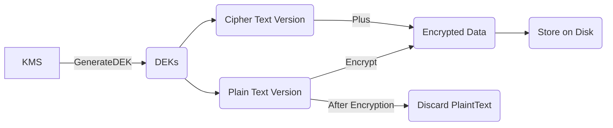
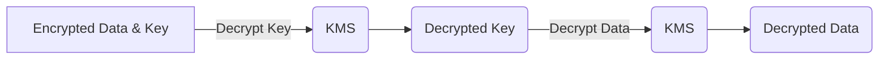

# KMS

## Introduction
* Regional & Public Service
* KMS keys never leave KMS
* KMS is FIPS 140-2(L2) compliant
* KMS keys contain physical key material, ID, creation date, resource policy, description & state
* KMS keys can be used to encrypt upto 4kb of data
* Permissions to Create a Key, Encrypt & Decrypt are seperate

## DEK(Data Encryption Keys)
* DEKs are generated by KMS using KMS keys using GenerateDataKey operation
* The KMS does not store DEKs but gives them to you to store them.

### Encryption Flow

### Decryption Flow

## Key Concepts
* A KMS key is stored within the region & that service
* KMS key never leaves the region or service
* KMS also supports multi region keys
* There are two types of KMS keys
    * AWS Owned
    * Customer Owned
        * AWS Managed - Created automatically by AWS
        * Customer Managed - Created by customers
        * Both support key rotation. With AWS managed keys this cant be disabled. Happens approximately once a year
        * With Customer Managed keys, rotation is on by default but can be disabled
        * A KMS key continues to maintain old rotated keys, so that data encrypted by old keys can still be decrypted.

## Key Policies
* Every KMS key has one resource policy
* For KMS keys trust policy for the account they are contained within must be explicitly added