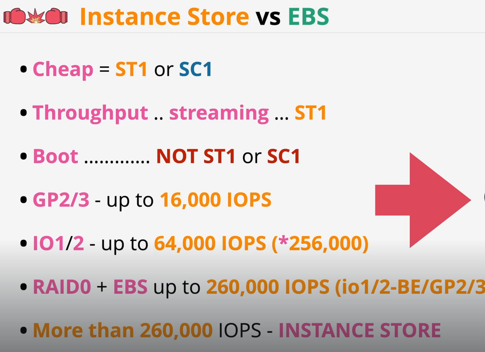

# Elastic Block Storage

* This is basic block storage with no structure
* A file system like ext3/4 or ntfs can be created on this as per requirements
* Storage is provisioned in one AZ i.e. resilient in an AZ
* EBS volumes are usually attached to 1 EC2 instance or some other services at one time. Other than specific cases of clustering where they are managed by a cluster application, they can not be attached to multiple instances
* EBS volumes can be detached from one & attached to a different instance 
* IF you backup an EBS volume into a snapshot stored on S3, then given nature of S3 this backup is regionally resilient.
* The billing is at GB-month of storage
* You can combine various EBS volume types into a RAID0 set. This gets combined performance of all those volumes, upto max of 260,000 IOPS

## EBS Volume Types

### General Purpose SSD - GP2 

* Volume sizes can vary from 1GB to 16TB
* When a GP2 volume it is created with an IO Credit allocation
* IO = 1 Input/Ourput Operation
* 1 IO Credit = 16 KB Chunk of data
* An IO Credit Bucket has capacity of 5.4 million credits.
* The minimum replinshment rate of IO Credit bucket is 100 Credits/Second
* Additionally the bucket gets 3 IO Credits per Second per GB of Volume size
* GP2 can burst upto 3000IOPS over and above the baseline rate
* Volumes upto 1TB use this IO Credit mechanism
* The maximum for GP2 volumes is 16000 IOPs & 250 MB/s of tranfer rates
* For larger volumes, the additional IOPS are added automatically

### General Purpose SSD - GP3

* Volume sizes can vary from 1GB to 16TB
* GP3 does not have concept of credit bucket
* All the volumes start with 3000 IOPS for all sizes of volumes. It can transfer at 125 MB/s
* The GP3 is 20% cheaper than GP2 upto 3000 IOPS
* There are extracosts for IOPS upto 16000 or transfer rates of 1000 MB/s
* Unlike GP2 for larger volumes the IOPS are not added automatically. They cost extra & need to be added manually

### Provisioned IOPS SSD - IO1

* IOPS are configurable irrespective of the size of the volume
* With IO1(and IO2) you can get maximum of 64000 IOPS & 1000 MB/s if transfer rates
* IO2 Block Express can give 256000 IOPS & 4000 MB/s transfer rates
* Volume sizes - IO1/2 - 4 GB to 16 TB. With IO2 BlockExpress 4 GB to 64 TB
* Maximum limits are there for size to performance ratio. For IO1 it is 50IOPS/GB (vs 3IOPS/Gb for GP2), IO2 500IOPS/GB, IO2 Express 1000 IOPS/GB

### HDD Based Volumes

* You can not use them as boot volumes
* Two types of HDD based volumes are 
    * st1 - ThroughtPut Optimized
    * sc1 - Cold HDD
* Good for sequentially accessed data but not good for Random Access
* IOP on HDD is measured in 1 MB blocks
* st1 - 125GB to 16 TB. Max 500 IOPS
* st1 - Base performance is 40MB/s/TB base. 250MB/s/TB Burst.
* sc1 - 125GB to 16 TB.Max 250 IOPS, 12 MB/s/TB base, 80 MB/s/TB Burst. Max 250 MB/s

### Instance store volumes
* Block storage devices. Attached at time of instance launch
* These are physically connected to 1 EC2 host
* Instances on same host can access the volume
* Highest storage performance in AWS
* Price is included in instance cost
* These are ephemeral volumes
* Instances when moved between hosts are given new blank ephemeral volumes

### Points to Remember

{: style="height:720px;width:1080px"}

### EBS Snapshots

* Incremental copies of EBS volumes to S3
* First snapshot is copy of full data of a volume. All future snapshots are incremental
* IF an incremental snapshot is deleted, EBS makes sure that all subsequent snapshots still work
* EBS restores snapshots lazily i.e. fetched gradually. 
* If data that is missing on snapshot right now, it is pulled from S3.
* Fast Snapshot Restore (FSR) ensures instant snapshot restore
* 50 FSR per region are allowed
* FSR costs additionally
* billed in GB-month of used data , not allocated data